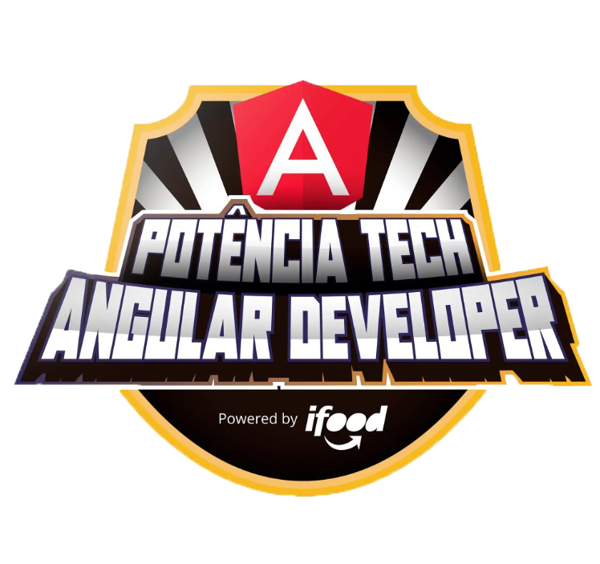
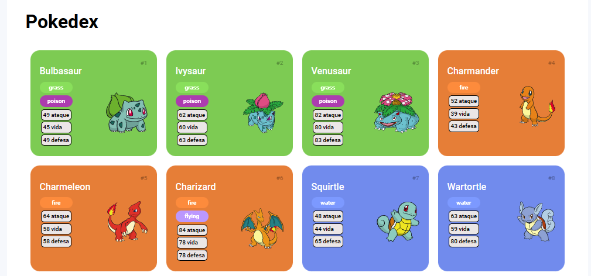
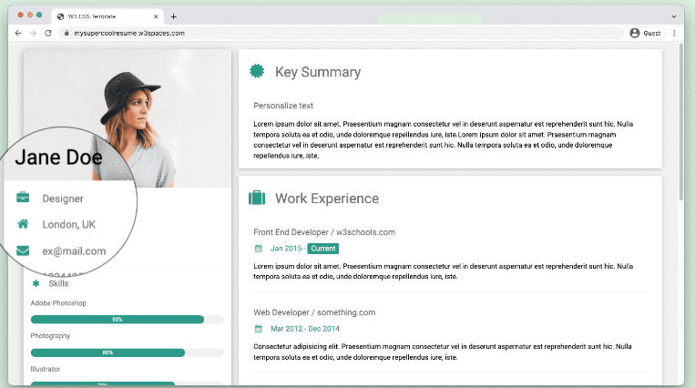
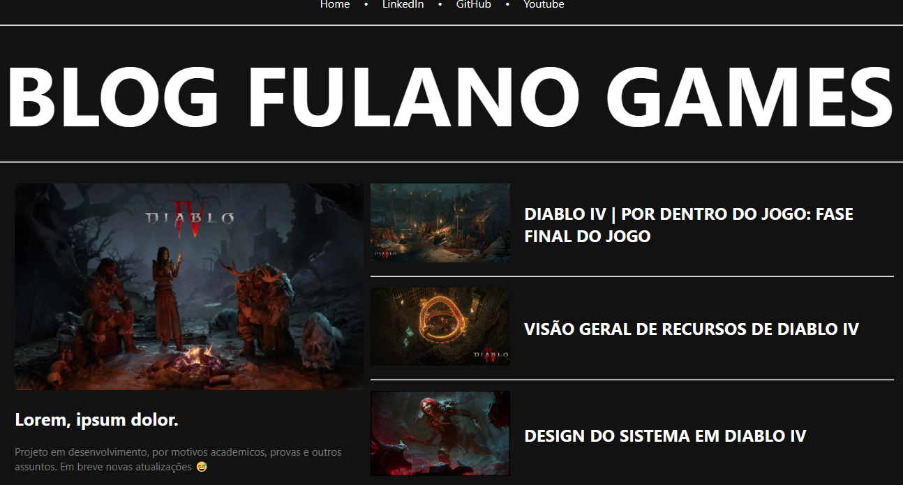
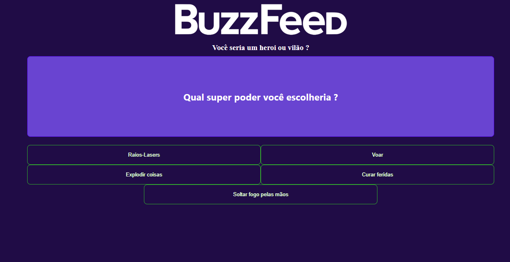

  

# Bootcamp Potência Tech Angular Developer

Este Bootcamp e focado em Angular, com cursos, desafios e mentorias.

## Detalhes do projeto

Abaixo estão as informações detalhadas do projeto:

|                 |                                                         |
| --------------- | ------------------------------------------------------- |
| :sparkles: Nome do curso | <b>Potência Tech Angular Developer - Powered by iFood</b>                        |
| :label: Tecnologias | HTML, CSS, JavaScript e Angular v14.1.2                                  |
| :rocket: URL do projeto: pokédex | https://felipe-ssantos.github.io/pokedex-pro-dio/                |
| :rocket: URL do projeto: currículo online | https://curriculo-online-kohl.vercel.app/         |
| :rocket: URL do projeto: criando um blog com Angular | https://angular-blog-tau.vercel.app/ |
| :rocket: URL do projeto: criando clone do BuzzzFeed com Angular| https://projeto-buzzfeed-dio.vercel.app/          |
| 📌 Status        | Concluído.                                               |

<!-- Botões -->

  
  
  
    
  

---

### 💻 Sobre o Bootcamp

- 5 projetos práticos;
- 10 desafios de códigos;
- 8 mentorias ao vivo;
- Networking com a comunidade do bootcamp;
- 75 horas de conteúdo.

---

### 📝 Etapas

- Primeiras Páginas Interativas com JavaScript
- Exercitando Lógica com Desafios de Código em JavaScript
- Ganhando Produtividade com a Plataforma Angular
- Explorando JSON na Prática com Desafios de Código
- Trabalhando com Rotas e Serviços no Angular

---

## 📷 Previews/Screenshots 

<h3>Pokédex</3>
  

---

<h3>Currículo Online</h3>
  

---

  <h3>Blog com Angular</h3>
  

---

  <h3>Clone do BuzzFeed com Angular</h3>
  

---

## 🤝 Contribuição

Contribuições são bem-vindas! Sinta-se à vontade para fazer um fork do repositório, fazer suas modificações e submeter um pull request.

---

Desenvolvido por N.F.S.S 💜 em parceria com a <a href="dio.me">Dio</a> 👋

